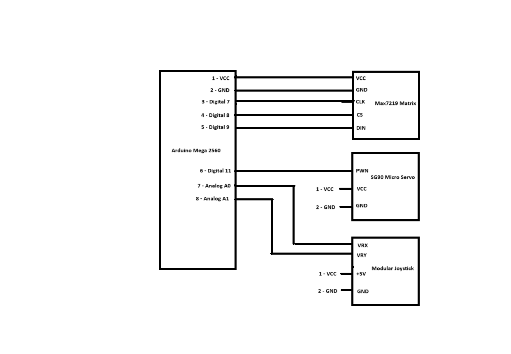

#Tetris on an 8 by 8 LED matrix with joystick control and servo rotation 

# Equipment needed:

```
● Arduino Mega 2560
● Max7219 Matrix
● SG90 Micro Servo
● Modular Joystick
```
# Setup

# Controls

Left - Moves piece Left
Right - Moves piece Right
Up - Rotates piece counterclockwise
Down - Fast fall
When this code is run, it with run a game similar to traditional Tetris, except when you complete
a line, the servo motor will rotate your display 90 degrees.


# Falling of The Blocks

Every 1 second, the block will move down 1 pixel as long as you do not input fast fall. This is
done by using an interrupt timer every 1 second that moves the piece down in the 4D array. This
4D array is filled with booleans. When a piece is active, it will set the array it is in to true, and
then when it moves, it takes the area it was previously at and sets it to false, but it will take the
area it moved to and set it to true. This is done by using a coordinate system to detect where
each segment of the piece is. This starts in the top left corner of the matrix, being (0,0), which
also correlates with the 4D array.

# The Blocks and Their Rotations

Each block is made in its matrix, which is then called when that piece is selected to fall It is a
matrix that is filled with booleans, and only the area that correlates with the shape of the block
will be set to true. For the rotations of each block, they have their own matrix. When the rotation
input is detected, it will set the rotation bool, which then will call the matrix that corresponds to
that block's rotation and replace the old piece with the newly rotated piece.

# Movement

There are four inputs for this game: move left, move right, fast fall, and rotate. The inputs come
from a modular joystick that is connected to the Arduino. Every 10ms, there is an interrupt timer
that checks if there is an input. If there is an input, it will do the input and then wait 100ms until it
receives another input to prevent the game from breaking. If the move left or right input is given,
it will shift the boolean values left or right, respectively. If a rotation input is detected, it will set
the rotation bool and then complete the rotation process discussed earlier. For the fast fall, it
sets one's very quickly until the lowest piece reaches a y coordinate equal to 8.

# Gravity

When a line is completed, the servo will rotate the matrix display. We then have the game rotate
in that direction, which causes the blocks currently on screen to fall, similar to sand. It checks
starting from the bottom if there is a block below it; if there isn't, then it keeps going down. It
checks to see if it can go left. If the block can not move left, it then goes right. This causes the
blocks from earlier to smooth out across the display.

# Video Link
https://drive.google.com/file/d/1lYJOwza6jdDVMWVrHQDlxFe_u3Uw3FBf/view?usp=sharing

